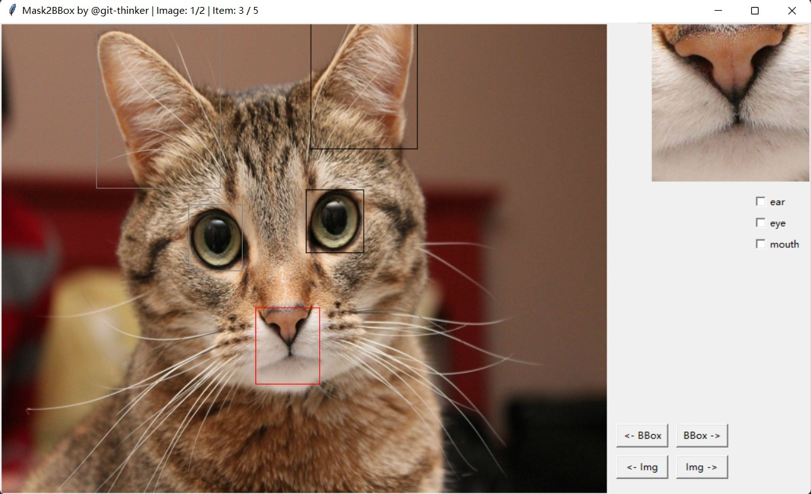

# Mask2BBox Labeller

Sometimes you have a unlabelled foreground segmentation mask for an image, but you still want a bbox and label for every instance in the foreground. Then try this out!


Mask2BBox Labeller takes a binary foreground segmentation mask and let user label every instance in the image.




Notice:

+ ASCII dir name support only.
+ There should be a `class.csv` in the image dir, where all class name is given in a single comma separated line.
+ Images and their masks should have names like `1.jpg`, `1-mask.jpg`.
+ Supported image formats include `.jpg`, `.png`, `.bmp`, `.jpeg`
+ There is no `save` button, since all modifications will be automatically saved when prev- or next- image button is cliecked.
+ Annotations will be saved to `anno.csv` in image dir. with bbox in `left`, `up`, `right`, `down` format.
+ The annotation file will be loaded if it exists and readable(have the correct classes setting), otherwise it will be overwritten. 


## Installation

### From github

```bash
git clone https://github.com/git-thinker/Mask2BBoxLabeller.git
cd Mask2BBoxLabeller
pip3 install -r requirements.txt
python3 main.py
```

### Binary

Try out windows executable file in the release page.