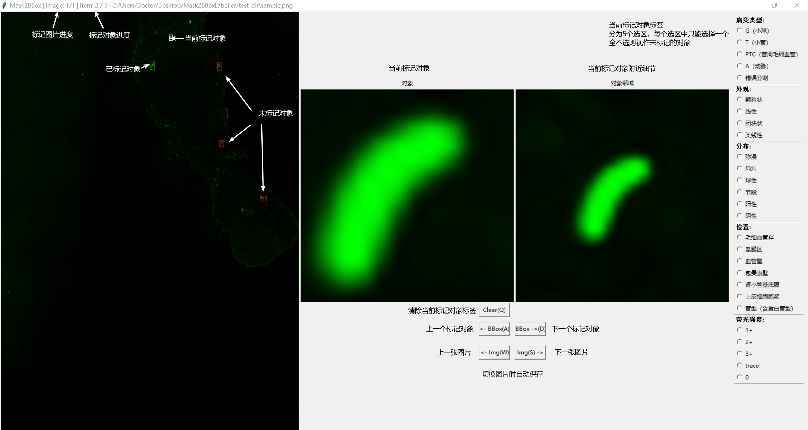

# Mask 2 BBox Labeller 使用指南

version1.0 (commit eccc0a)

这是一份Mask2BBoxLabeller的使用指南。Mask2BBoxLabeller是一个基于Python开发的工具，旨在为已有分割遮罩的图片，标记目标检测的边际框和分类。

## 第一步 准备图片与遮罩

文件夹与文件名应为全英文，将图片和遮罩分别命名为`{名称}.jpg`和`{名称}-mask.jpg`，如下图用例。图片与遮罩的扩展名支持`.jpg`和`.png`。

## 第二步 选择路径

分别选择图片路径和遮罩路径，两个路径可以一致。本工具会自动搜索名称相符的图片和遮罩对。

设置输出目录，本工具会向输出目录下的`anno.csv`写入数据。如果改文件已经存在，工具会尝试载入改文件以恢复上次标记的进度。载入失败时，工具会覆写该文件。

缩放图片选项是用于在启动时把图片缩小到指定大小显示，会过于耗时，并且可能导致标记不准，不建议使用。

## 第三步 标记

工具中央显示的是当前标记对象和其附近的细节。右侧是标记标签，分为5个选区，每个选区内只能选择一个选项。任意标记一个则该对象会被视作已经标记。点击中央的`Clear`按钮或者是使用快捷键`Q`清除当前标记对象的所有标记标签。

## 第四步 切换标记对象

工具左侧预览图显示所有标记对象在图片中的位置。其中，当前标记对象使用白色边框标记，未标记对象使用红色边框标记，已标记对象使用绿色边框标记。当前标记对象进度在窗口的标题栏中显示。点击中央的`<-BBox`|`BBox->`按钮或者是使用快捷键`A`|`D`分别向前和向后切换标记对象。

## 第五步 切换标记图片

当前标记图像进度在窗口的标题栏中显示。点击中央的`<-Img`|`Img->`按钮或者是使用快捷键`W`|`S`分别向前和向后切换标记图片。

## 保存

工具实现自动保存，在以下的情形时，自动保存：
1. 切换图片时
2. 点按窗口右上角退出时

## 其他

在图片过大的时候，工具占用的内存较大，标记对象和图片的切换可能比较耗时，请耐心等待。